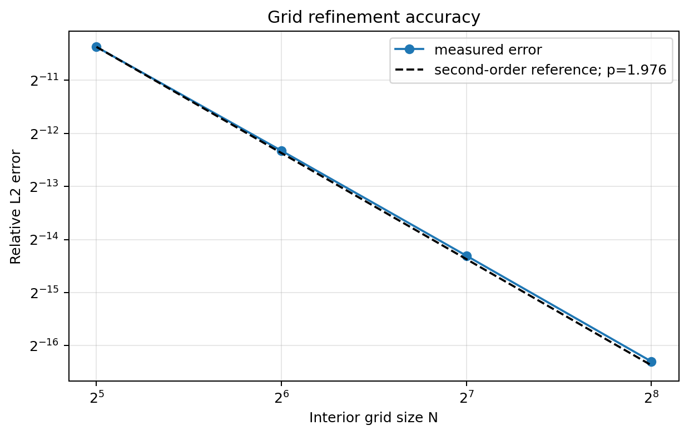
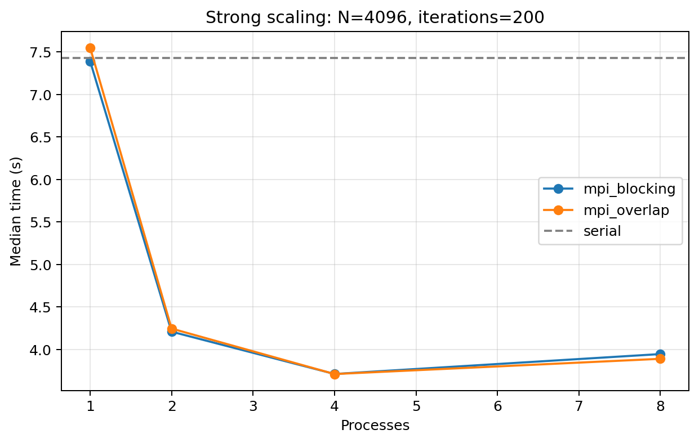
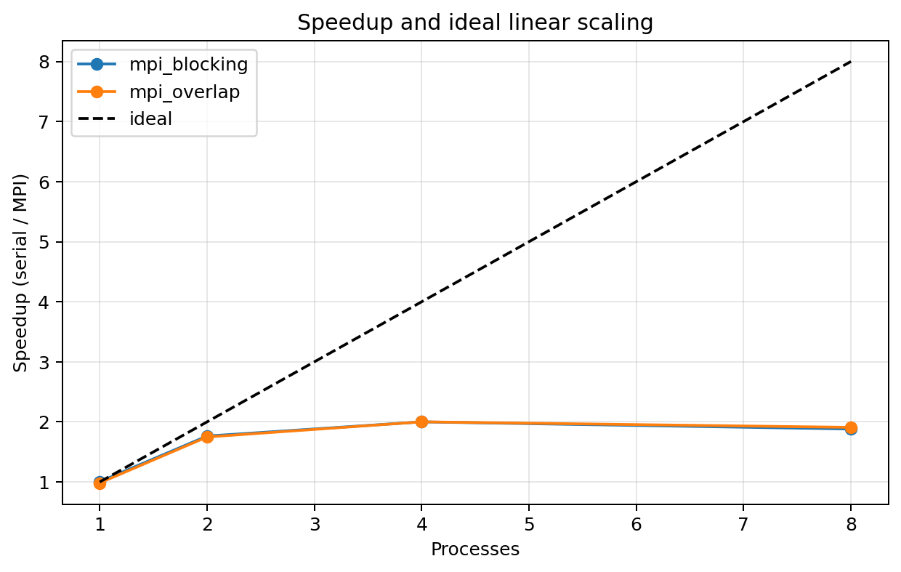
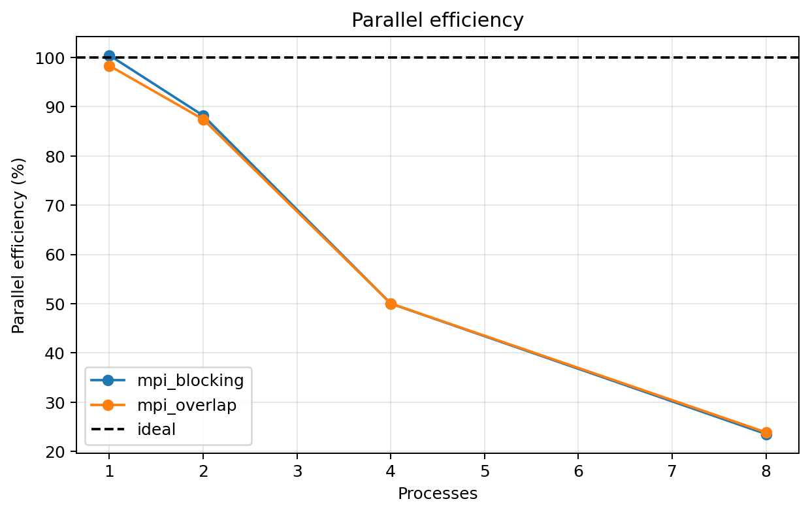
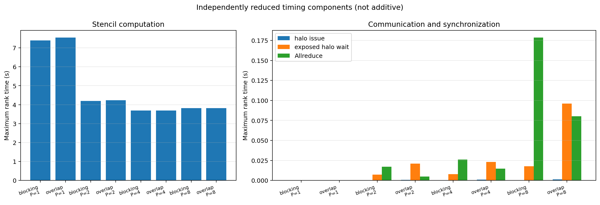
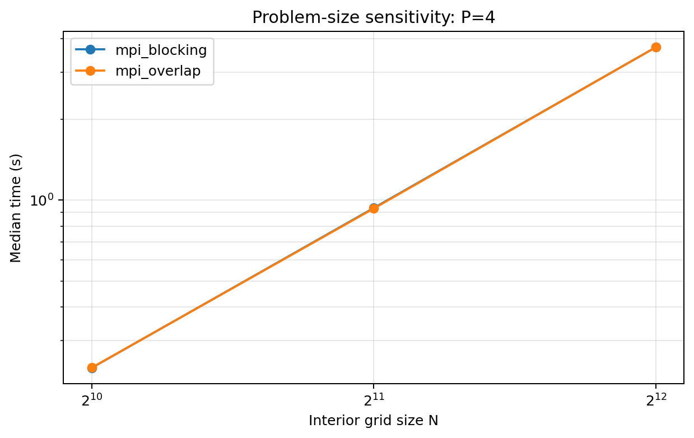
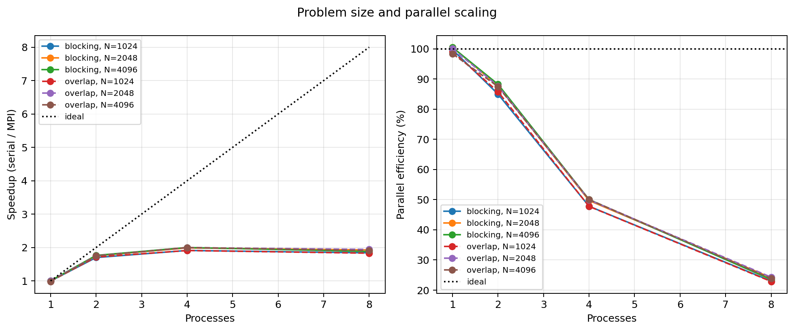
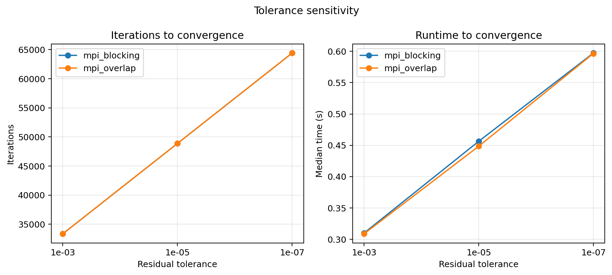
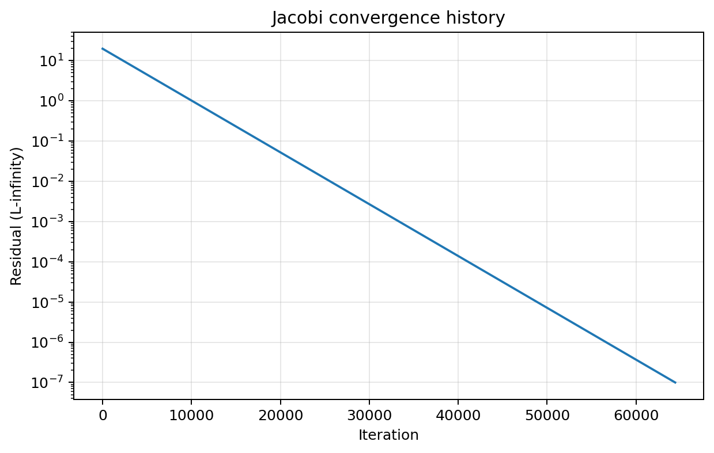
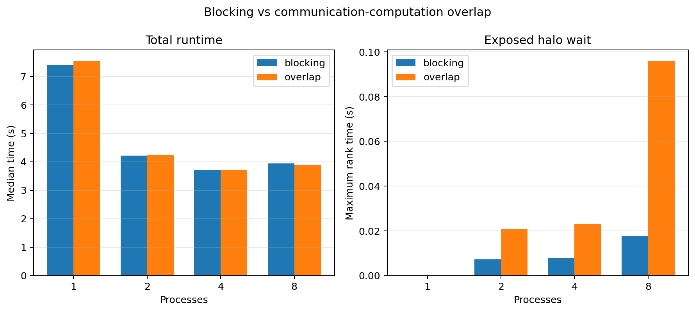

# 二维 Poisson Jacobi 的 MPI 域分解、性能分析与通信重叠优化

> 实验于 2026 年 9 月 2 日在单节点环境完成。本文所有表格和图片均来自 `results/` 中保存的原始数据，没有使用推测或虚构结果。

## 1. 实验内容

本实验求解单位正方形上的二维 Poisson 方程：

\[
-\Delta u=f,\qquad u|_{\partial\Omega}=0.
\]

采用均匀网格、二阶五点差分和 Jacobi 迭代。为验证数值结果，选择

\[
u(x,y)=\sin(\pi x)\sin(\pi y),\qquad
f(x,y)=2\pi^2\sin(\pi x)\sin(\pi y).
\]

实现串行、Blocking MPI 和 Overlap MPI 三个版本。实验依次研究程序一致性、空间离散精度、单节点强扩展、问题规模和容差敏感性、时间组成及通信—计算重叠效果。

## 2. 实验目的

1. 掌握 MPI 进程模型、一维区域分解、halo 交换和全局归约。
2. 理解 Jacobi 迭代收敛误差与有限差分空间离散误差的区别。
3. 掌握 Speedup、Efficiency、强扩展和重复测量的实验方法。
4. 使用分项计时定位计算、邻居通信和全局同步瓶颈。
5. 通过非阻塞通信检验通信—计算重叠能否降低暴露通信时间。

## 3. 实验环境

实验机配置为 Ubuntu 22.04（Linux 6.8.0）、Intel Xeon E5-1620 v4、4 个物理核心/8 个逻辑 CPU、31 GiB 内存，使用 GCC 11.4.0 和项目内安装的 OpenMPI 4.1.6。完整环境快照保存在 `results/system_info.txt`。

本阶段只报告单节点实验。1/2/4 进程用于物理核心强扩展，8 进程用于观察超线程影响。多节点实验必须在真实集群上测量后另行补充。

## 4. 实验步骤

### 4.1 环境搭建

```bash
make env
source scripts/activate_env.sh
make
make test
```

上述命令将 OpenMPI 4.1.6 与 Python 绘图环境安装在项目目录内，无需 root 权限。正式报告记录的 MPI 版本以 `results/system_info.txt` 为准。

### 4.2 串行离散与迭代

设网格间距 $h=1/(N+1)$。五点差分 Jacobi 更新为

\[
u_{i,j}^{(k+1)}=\frac{1}{4}
\left(u_{i-1,j}^{(k)}+u_{i+1,j}^{(k)}+
u_{i,j-1}^{(k)}+u_{i,j+1}^{(k)}+h^2f_{i,j}\right).
\]

程序由零初值开始，边界保持为零。更新量通过 $4/h^2$ 换算为离散残差无穷范数。

### 4.3 MPI 域分解

内部网格按连续行划分，不能整除时前若干 rank 多保存一行。每个进程分配 `local_rows + 2` 行，其中第 0 行和最后一行是 halo。左右边界保存在每行首尾元素中并始终为零。

```text
global top boundary
-------------------
rank 0: local rows + bottom halo
-------------------
rank 1: top halo + local rows + bottom halo
-------------------
...
-------------------
rank P-1: top halo + local rows
-------------------
global bottom boundary
```

Blocking 版使用两次 `MPI_Sendrecv` 完成上下交换，然后更新全部本地行。每轮再使用 `MPI_Allreduce(MPI_MAX)` 得到全局残差。

### 4.4 通信重叠优化

Overlap 版按以下顺序执行：

1. 为上下 halo 发起 `MPI_Irecv`，并发出首尾本地行。
2. 计算不依赖新 halo 的内部行。
3. 执行 `MPI_Waitall`。
4. 计算首尾边界行。
5. 执行全局残差归约。

该优化不减少通信量。实验关注的是 `halo_wait_seconds`，即未被内部计算隐藏、仍暴露在关键路径上的等待。

### 4.5 自动实验

```bash
make pilot
FIXED_ITERS=200 SIZE_LIST="1024 2048 4096" \
  PROCESSES="1 2 4 8" REPETITIONS=5 WARMUPS=1 make benchmark
make correctness
make accuracy
make plots
```

每组性能配置预热 1 次并正式运行 5 次，图中使用中位数。固定迭代模式用于所有版本间性能对照。

## 5. 实验分析

### 5.1 程序正确性

采用 $N=65$、固定 500 轮，并用 4 个 MPI 进程制造不能整除的行划分。结果如下：

| 版本 | 残差 | 相对 $L_2$ 误差 | checksum |
|---|---:|---:|---:|
| Serial | 11.213168807637512 | 0.5673406568474070 | 763.5371658011369 |
| Blocking MPI | 11.213168807637512 | 0.5673406568474060 | 763.5371658011400 |
| Overlap MPI | 11.213168807637512 | 0.5673406568474060 | 763.5371658011400 |

两个 MPI 版本与串行版的残差完全一致，相对误差差约 $1.0\times10^{-15}$，checksum 差约 $3.1\times10^{-12}$。差异仅来自并行求和顺序造成的浮点舍入，说明域分解、halo 交换和不均匀行划分均正确。固定 500 轮实验只验证实现一致性，最终数值精度由下一节的收敛实验验证。

### 5.2 空间二阶精度

对 $N=32,64,128,256$ 使用 $10^{-6}$ 的残差阈值，计算

\[
p=\log_2\frac{E_N}{E_{2N}}.
\]

| $N$ | 相对 $L_2$ 误差 | 观测阶 $p$ |
|---:|---:|---:|
| 32 | $7.5554\times10^{-4}$ | — |
| 64 | $1.9464\times10^{-4}$ | 1.9567 |
| 128 | $4.9375\times10^{-5}$ | 1.9789 |
| 256 | $1.2402\times10^{-5}$ | 1.9932 |



理论上五点差分具有二阶空间精度。观测阶从 1.9567 稳定趋近 1.9932，验证了解析误差满足 $E(h)=O(h^2)$。这里的 $E_N$ 是空间离散误差，不是迭代残差；即使残差已经达到阈值，有限网格仍保留离散误差。

### 5.3 单节点强扩展

pilot 结果表明 $4096\times4096$ 网格固定 200 轮的串行时间为数秒，因此将其选为正式强扩展工作量。正式采样将串行程序固定在一个逻辑 CPU 上，MPI 在 1/2/4 进程时按物理核绑定、8 进程时按硬件线程绑定。串行中位数 $T_{serial}=7.4248$ 秒，各配置结果如下：

\[
S_p=\frac{T_{serial}}{T_p},\qquad
\eta_p=\frac{S_p}{p}.
\]

| 进程数 | Blocking 时间/s | Blocking 加速比 | Blocking 效率 | Overlap 时间/s | Overlap 加速比 | Overlap 效率 |
|---:|---:|---:|---:|---:|---:|---:|
| 1 | 7.3906 | 1.005 | 100.5% | 7.5498 | 0.983 | 98.3% |
| 2 | 4.2086 | 1.764 | 88.2% | 4.2450 | 1.749 | 87.5% |
| 4 | 3.7110 | 2.001 | 50.0% | 3.7102 | 2.001 | 50.0% |
| 8 | 3.9453 | 1.882 | 23.5% | 3.8895 | 1.909 | 23.9% |







1→2 进程取得约 1.76 倍加速和 88% 效率；2→4 仍有收益，但总加速约为 2.00 倍，说明共享内存访问与同步开销开始主导。8 进程使用同一组物理核的两个硬件线程，Blocking 和 Overlap 分别比 4 进程慢约 6.3% 和 4.8%，说明该内存密集型 stencil 无法从超线程获得额外吞吐。统一绑核后，串行与 1 进程 Blocking 仅相差约 0.5%，消除了原先比较口径不一致造成的疑点。

### 5.4 性能机理

按计算、halo 调用、暴露 halo 等待和 Allreduce 拆分时间。下表列出各进程最大值的中位数：

| 版本 | 进程 | 计算/s | halo issue/s | 暴露 halo wait/s | Allreduce/s |
|---|---:|---:|---:|---:|---:|
| Blocking | 2 | 4.1948 | 0 | 0.0073 | 0.0172 |
| Blocking | 4 | 3.6921 | 0 | 0.0077 | 0.0260 |
| Blocking | 8 | 3.8164 | 0 | 0.0177 | 0.1788 |
| Overlap | 2 | 4.2401 | 0.0005 | 0.0209 | 0.0049 |
| Overlap | 4 | 3.6968 | 0.0011 | 0.0232 | 0.0147 |
| Overlap | 8 | 3.8186 | 0.0012 | 0.0961 | 0.0801 |



计算时间占总时间的绝大部分，但它从 2 到 4 进程只下降约 12%，到 8 进程反而增加，符合共享内存带宽压力增大的特征。串行版实际分配 `old_grid`、`new_grid` 和 `rhs_grid` 三个 $(N+2)^2$ 双精度数组；$N=4096$ 时共 403,046,496 字节（约 384.4 MiB），远大于处理器 10 MiB 末级缓存。这里不能表述为所有访问都“击穿缓存”：stencil 的滑动窗口仍有行内和邻行复用；严谨结论是整个数组无法常驻 LLC，每轮扫描必然形成大量流式内存访问。

以 4 进程 Blocking 的中位数估算，200 轮完成约 $3.36\times10^9$ 次网格更新，即约 905 Mupdates/s。若采用每更新 24--32 字节的简化流量模型，有效流量约为 21.7--29.0 GB/s；该值只是算法模型估算，并非内存控制器实测值。它低于 E5-1620 v4 的 76.8 GB/s 理论峰值，因此本实验只能说扩展曲线与内存带宽压力相符，不能声称已经测得或达到硬件带宽上限。若要做完整 Roofline，应另用 STREAM 和硬件性能计数器测量可持续带宽及实际流量。

每个计时分量分别对所有 rank 取最大值，最大值可能来自不同 rank，因此图中改用分组柱而不作可加和的堆叠。`MPI_Allreduce` 的墙钟时间还包含集合操作入口处的到达等待：某 rank 较早到达时会等待计算较慢或受调度抖动影响的 rank，所以该指标并非纯粹的归约计算/传输时间，也不要求随进程数单调变化。

### 5.5 参数敏感性

固定 200 轮的完整规模—进程矩阵如下。串行时间也对每个规模独立测量，从而能比较“问题变大是否改善并行收益”。

| $N$ | Serial/s | Blocking P=1 | P=2 | P=4 | P=8 |
|---:|---:|---:|---:|---:|---:|
| 1024 | 0.4546 | 0.4560 | 0.2675 | 0.2378 | 0.2470 |
| 2048 | 1.8598 | 1.8503 | 1.0609 | 0.9356 | 0.9646 |
| 4096 | 7.4248 | 7.3906 | 4.2086 | 3.7110 | 3.9453 |

| $N$ | Serial/s | Overlap P=1 | P=2 | P=4 | P=8 |
|---:|---:|---:|---:|---:|---:|
| 1024 | 0.4546 | 0.4590 | 0.2650 | 0.2380 | 0.2484 |
| 2048 | 1.8598 | 1.8586 | 1.0607 | 0.9317 | 0.9568 |
| 4096 | 7.4248 | 7.5498 | 4.2450 | 3.7102 | 3.8895 |



网格边长每扩大一倍，时间分别增至约 3.94 和 3.96 倍，与二维网格每轮 $O(N^2)$ 的工作量一致。两个 MPI 版本的曲线几乎重合，说明单节点上扩大问题规模仍未使通信重叠产生可测收益。



三个规模在 4 进程时的 Blocking 加速比分别为 1.912、1.988 和 2.001，随规模增大略有改善，但都远低于理想的 4 倍；8 进程又一致回退。因此“较大问题具有更好的计算通信比”在本机只带来有限改善，共享内存流量和硬件线程竞争仍是主要限制。

在 $N=128$、4 进程下改变残差阈值。各组运行达到 0.3--0.6 秒，避免了几十毫秒量级测量中计时噪声占比过高的问题：

| 容差 | 迭代数 | Blocking/s | Overlap/s |
|---:|---:|---:|---:|
| $10^{-3}$ | 33350 | 0.3097 | 0.3085 |
| $10^{-5}$ | 48878 | 0.4563 | 0.4485 |
| $10^{-7}$ | 64406 | 0.5973 | 0.5967 |





容差每收紧两个数量级，迭代数增加 15528，运行时间随之近似线性增加。残差整体平稳下降并最终达到阈值。值得注意的是，解析误差不会随迭代容差严格单调下降：三档容差的相对 $L_2$ 误差约为 $1.22\times10^{-6}$、$4.89\times10^{-5}$ 和 $4.94\times10^{-5}$。较松容差下迭代误差偶然抵消了部分空间离散误差；迭代充分后则趋近该网格的离散误差。这正说明残差与解析误差是两个不同量。

### 5.6 Blocking 与 Overlap



Overlap 相对 Blocking 在 1/2 进程下分别慢约 2.15% 和 0.86%，在 4/8 进程下分别快约 0.02% 和 1.42%。这些差值小且方向不一致，8 进程自身抖动也明显高于 4 进程，因此不能据此声称非阻塞版本获得稳定性能提升。Overlap 的暴露等待总体仍高于 Blocking，说明潜在重叠没有转化为更短的关键路径。

这是合理的负结果：单节点共享内存 halo 消息很短，Blocking 交换本身只占总时间很小比例；OpenMPI 在内部计算期间未必提供充分异步进展，而 rank 间计算进度差异也会在 `MPI_Waitall` 中表现为等待。与此同时，额外的非阻塞调用和请求管理带来少量开销。因此该优化方向合理，但在当前单节点、内存带宽受限的环境中缺乏获益条件。

## 6. 问题与讨论

1. **为什么 4→8 没有继续加速？** 机器只有 4 个物理核心，8 个进程共享执行单元和内存带宽。Jacobi stencil 的算术强度较低，超线程无法弥补带宽瓶颈，同时增加了同步竞争。
2. **为什么非阻塞通信没有带来收益？** 非阻塞调用只允许潜在重叠，不保证后台通信进展。当共享内存 halo 交换本来就很短、内部计算又受内存带宽限制时，调用管理与负载不均衡足以抵消可隐藏的通信。
3. **残差和解析误差有什么区别？** 残差衡量离散线性系统是否求解充分；解析误差还包含有限差分截断误差。网格加密实验中残差阈值固定而解析误差约按 $h^2$ 下降，从实验上区分了两者。
4. **多节点后可能发生什么？** halo 将经过网络，通信时间占比会提高；每轮 `MPI_Allreduce` 还会形成跨节点全局同步。Overlap 可能更有价值，但必须重新实测，不能从单节点数据外推具体加速比。
5. **为什么没有把 `MPI_Waitall` 改为 `MPI_Waitany`？** 当前 Overlap 每轮包含两个接收和两个发送请求。`Waitany` 理论上可在上/下 halo 任一接收完成后立即计算对应边界行，但仍须在复用发送缓冲区前完成发送请求。单节点两条短消息通常接近同时完成，额外状态管理的复杂度和出错风险高于可测收益，因此本实验只将其列为多节点上的后续优化。
6. **为什么选择按行分解？** C 的行主序使整条 halo 行连续，可直接发送而无需打包。若按列分解，列元素跨步不连续，可手工 Pack/Unpack，或用 `MPI_Type_vector`（规则列）及 `MPI_Type_create_subarray` 描述；派生类型简化接口，但 MPI 实现仍可能在内部打包，不能等同于保证零拷贝。
7. **一维分解的局限是什么？** 它只有两个邻居、实现简单，但进程数受网格行数限制。二维分解可降低每个子域的边界长度，却增加邻居数和消息数，需要结合规模与网络特性权衡。

综上，三版程序数值结果一致，五点差分达到接近二阶的空间精度；单节点最佳区域是 4 个进程，Blocking/Overlap 中位时间均约为 3.71 秒、相对串行加速约 2.00 倍。完整 $N\times P$ 矩阵表明规模增大只略微改善效率，8 进程受超线程和共享内存带宽压力影响没有继续加速，通信重叠在当前环境中也未表现出稳定收益。实验完成了从正确性、数值精度到性能机理和优化验证的完整闭环。

## 参考资料

1. MPI Forum, *MPI Standard*: https://www.mpi-forum.org/docs/
2. Open MPI Documentation: https://docs.open-mpi.org/
3. William H. Press et al., *Numerical Recipes*, relaxation methods for elliptic equations.
4. Randall J. LeVeque, *Finite Difference Methods for Ordinary and Partial Differential Equations*.
5. Intel, *Xeon E5-1620 v4 Specifications*: https://www.intel.com/content/www/us/en/products/sku/92991/intel-xeon-processor-e51620-v4-10m-cache-3-50-ghz/specifications.html
